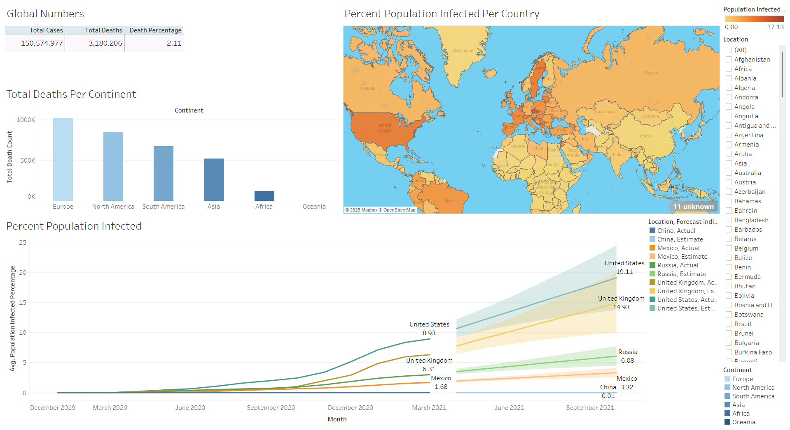

# Covid-19 Analysis

## Table of Contents
- [Project Overview](#project-overview)
- [Data Sources](#data-sources)

- ### Project Overview
---
This project provides an in-depth data analysis of the COVID-19 pandemic using Tableau. The analysis covers key metrics such as infection rates, vaccination trends, mortality rates, and geographic spread. Visual dashboards were created to present actionable insights and highlight significant patterns in the data.

## **Data Source**  
The dataset was obtained from [Our World in Data](https://ourworldindata.org/covid-deaths), a trusted source for global COVID-19 statistics. The following datasets were used:  
- [CovidDeaths.xlsx](./CovidDeaths.xlsx) — contains global data on COVID-19 cases and deaths.  
- [CovidVaccinations.xlsx](./CovidVaccinations.xlsx) — contains global vaccination statistics.

## **Key Insights**  
- Analysis of trends in confirmed cases and deaths.  
- Insights into vaccination coverage across regions.  
- Comparative analysis of mortality and vaccination rates.

### Tools
- SQL Server Management Studio - Data Exploration and Analysis
- Tableau - Creating reports and dashboard

### Exploratory Data Analysis

EDA involved exploring the sales data to answer key questions, such as:
- which country had the highest infection rate compared to population and also by continent?
- which are the Countries with Highest Death Count per Population?
- What percentage of the population has received at least one dose of the COVID-19 vaccine?

## **Dashboard Visualization**  
I created an interactive dashboard on Tableau to visualize the insights from the COVID-19 data analysis. You can view it [here on Tableau Public](https://public.tableau.com/views/Covid-19Data_17377305964060/Dashboard1?:language=en-US&publish=yes&:sid=&:redirect=auth&:display_count=n&:origin=viz_share_link).

